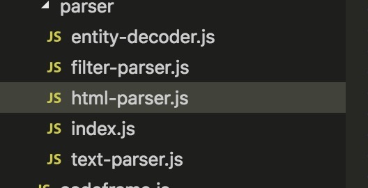

<!-- # 深入浅出 Vue.js 第九章---学习笔记 -->
谢运明 electron
李豪 跨平台uni-app，各平台差异
陈思聪 webrtc/基础
赵伟 typescript + vue

本文结合 Vue 源码进行学习<br>
学习时，根据 github 上 Vue 项目的 package.json 文件，可知版本为 2.6.10
## 解析器

## 一、解析器的作用
解析器的作用就是将模版解析成 AST（抽象语法树）

在 Vue 中，解析 template 里面的 DOM 元素转换出来的 AST，是一个 Javascript 对象

该 AST 是使用 JavaScript 中的对象来描述一个节点

一个对象表示一个节点，对象中的属性用来保存节点所需的各种数据

parent 属性用来保存父节点的描述对象，children 属性是一个数组，保存了多个子节点的描述对象

多个独立的节点通过 parent 属性和 children 属性连在一起时，就变成了一棵树，而这样一个用对象描述的节点树就称之为 AST （抽象语法树）

例子：
html 元素
```html
<div>
    <p>{{ name }}</p>
</div>
```
经过解析变成下面格式，即转换成了 AST
```javascript
{
    tag: 'div',
    type: 1,
    staticRoot: false,
    static: false,
    plain: true,
    parent: undefined,
    attrsList: [],
    attrsMap: {},
    children: [
        {
            tag: 'p',
            type: 1,
            staticRoot: false,
            static: false,
            plain: true,
            parent: {
                tag: 'div',
                ...
            },
            attrsList: [],
            attrsMap: {},
            children: [
                {
                    type: 2,
                    text: '{{ name }}',
                    static: false,
                    expression: '_s(name)',
                }
            ]
        }
    ]
}
```

## 二、解析器内部运行的原理
Vue 内部有多个解析器，看下图 filter 过滤解析器、html 解析器、text 文本解析器



这边讲解 html 解析器

html 解析器解析 html 元素，解析过程中，会不断的触发各种钩子函数

钩子函数有：

开始标签钩子函数<br>
结束标签钩子函数<br>
文本钩子函数<br>
注释钩子函数<br>

```javascript
parseHTML(html, {
    /**
     * @param {string}  tagName 解析到的开始标签名，如 <div></div> 中开始标签 <div> 中的div
     * @param {Array}   attrs   解析到的开始标签上的属性，如 [{name: 'class', value: 'className'}]
     * @param {Boolean} unary   标签是否时自闭合标签， true 或者 false
     * @param {Number}  start   解析到的开始标签在需要解析的 html 模版中所占的开始位置
     * @param {Number}  end     解析到的开始标签在需要解析的 html 模版中所占的结束位置
     */
    start(tagName, attrs, unary, start, end) {
        // 每当解析到标签的开始位置时，触发该函数
    },
    /**
     * @param {string} tagName  解析到的结束标签名，如 <div></div> 中结束标签 </div> 中的div
     * @param {Number} start    解析到的结束标签在需要解析的 html 模版中所占的开始位置
     * @param {Number} end      解析到的结束标签在需要解析的 html 模版中所占的结束位置
     */
    end(tagName, start, end) {
        // 每当解析到标签的结束位置时，触发该函数
    },
    /**
     * @param {string} text  解析到的纯文本，如 <p>我是纯文本</p> 中 p 标签包含的纯文本
     * @param {Number} start 解析到的纯文本在需要解析的 html 模版中所占的开始位置。注：不一定有，可能没传
     * @param {Number} end   解析到的纯文本在需要解析的 html 模版中所占的结束位置。注：不一定有，可能没传
     */
    chars(text, start?, end?) {
        // 每当解析到文本时，触发该函数
    },
    /**
     * @param {string} text  解析到的注释，如 <!-- 我是注释 -->。text经过处理，截取了注释箭头中的纯文本
     * @param {Number} start 解析到的注释在需要解析的 html 模版中所占的开始位置
     * @param {Number} end   解析到的注释在需要解析的 html 模版中所占的结束位置
     */
    comment(text, start, end) {
        // 每当解析到注释时，触发该函数
    }
})
```

例子：

```html
<div>
    <p>我是文本</p>
</div>
```

解析上面的模版，从前向后解析，依次触发 start、start、chars、end、end 钩子函数
||||
|-|-|-|
| 解析到 | \<div\> | 触发 start |
| 解析到 | \<p\> | 触发 start |
| 解析到 | 我是文本 | 触发 chars |
| 解析到 | \</p\> | 触发 end |
| 解析到 | \</div\> | 触发 end |


各个钩子函数如何构建 AST 节点?

start 钩子函数
```javascript
// /src/compiler/parse/index.js
export function createASTElement (
  tag: string,
  attrs: Array<ASTAttr>,
  parent: ASTElement | void
): ASTElement {
  return {
    type: 1,
    tag,
    attrsList: attrs,
    attrsMap: makeAttrsMap(attrs),
    rawAttrsMap: {},
    parent,
    children: []
  }
}
parseHTML(template, {
    start(tag, attrs, unary, start, end) {
        let element: ASTElement = createASTElement(tag, attrs, currentParent)
    }
})
```

end 钩子函数
```javascript
// /src/compiler/parse/index.js
function closeElement (element) {
    // ...

    currentParent.children.push(element)
    element.parent = currentParent

    // ...
}
parseHTML(template, {
    end(tag, start, end) {
        const element = stack[stack.length - 1]
        // pop stack
        stack.length -= 1
        currentParent = stack[stack.length - 1]
        closeElement(element)
    }
})
```

chars 钩子函数
```javascript
// /src/compiler/parse/index.js
parseHTML(template, {
    chars(text, start, end) {
        let child: ASTNode = {
            type: 3,
            text
        }
    }
})
```

comment 钩子函数
```javascript
// /src/compiler/parse/index.js
parseHTML(template, {
    start(text, start, end) {
        const child: ASTText = {
          type: 3,
          text,
          isComment: true
        }
    }
})
```

上面构建出来的节点是独立的

我们需要一套逻辑把这些节点连起来，构成一个真正的 AST

下面介绍一下如何构建 AST 层级关系

解析 html 的时候，我们需要维护一个栈 （stack），用 stack 来记录层级关系，也可以理解为 DOM 的深度

每当遇到开始标签，触发 start 钩子函数；每当遇到结束标签，触发 end 钩子函数。<br>
基于以上情况，我们在触发 start 钩子函数时，将当前构建的节点推入 stack 中；触发 end 钩子函数时，从 stack 中弹出一个节点。<br>
这样就可以保证每当触发 start 钩子函数时，stack 的最后一个节点就是当前正在构建的节点的父节点

例子：

```html
<div>
    <h1>我是大标题</h1>
    <p>我是文本</p>
</div>
```

解析时具体细节

| 解析时候的 html 模版 | 解析到 | 解析后的stack | 解析后的AST | 解析后 |
|-|-|:-:|-|-|
| \<div\>&nbsp<br>\<h1\>我是大标题\</h1\>&nbsp<br>\<p\>我是文本\</p\><br>\</div\> | 解析到 \<div\> | div | { tag: 'div' } | 模版中 \<div\> 被截取掉 |
| &nbsp<br>\<h1\>我是大标题\</h1\>&nbsp<br>\<p\>我是文本\</p\><br>\</div\> | 解析到 空格 | div | { tag: 'div' } | 模版中空格被截取掉 |
| \<h1\>我是大标题\</h1\>&nbsp<br>\<p\>我是文本\</p\><br>\</div\> | 解析到 \<h1\> | div h1 | { tag: 'div', children:[ { tag: 'h1' } ] } | 模版中 \<h1\> 被截取掉 |
| 我是大标题\</h1\>&nbsp<br>\<p\>我是文本\</p\><br>\</div\> | 解析到 我是大标题 | div h1 |  { tag: 'div', children:[ { tag: 'h1', children: [ { text: '我是大标题' } ] } ] } | 模版中 我是大标题 被截取掉 |
| \</h1\>&nbsp<br>\<p\>我是文本\</p\><br>\</div\> | 解析到 \</h1\> | div | { tag: 'div', children:[ { tag: 'h1', children: [ { text: '我是大标题' } ] } ] } | 模版中 \</h1\> 被截取掉 |
| &nbsp<br>\<p\>我是文本\</p\><br>\</div\> | 解析到 空格 | div | { tag: 'div', children:[ { tag: 'h1', children: [ { text: '我是大标题' } ] } ] } | 模版中 空格 被截取掉 |
| \<p\>我是文本\</p\><br>\</div\> | 解析到 \<p\> | div p | { tag: 'div', children:[ { tag: 'h1', children: [ { text: '我是大标题' } ] }, { tag: 'p' } ] } | 模版中 \<p\> 被截取掉 |
| 我是文本\</p\><br>\</div\> | 解析到 我是文本 | div p | { tag: 'div', children:[ { tag: 'h1', children: [ { text: '我是大标题' } ] }, { tag: 'p', children: [ { text: '我是文本' } ] } ] } | 模版中 我是文本 被截取掉 |
| \</p\><br>\</div\> | 解析到 \</p\> | div | { tag: 'div', children:[ { tag: 'h1', children: [ { text: '我是大标题' } ] }, { tag: 'p', children: [ { text: '我是文本' } ] } ] } | 模版中 \</p\> 被截取掉 |
| \</div\> | 解析到 \<div\> | - | { tag: 'div', children:[ { tag: 'h1', children: [ { text: '我是大标题' } ] }, { tag: 'p', children: [ { text: '我是文本' } ] } ] } | 模版中 \</div\> 被截取掉 |
| - | html 模版为空，解析完成 | - | { tag: 'div', children:[ { tag: 'h1', children: [ { text: '我是大标题' } ] }, { tag: 'p', children: [ { text: '我是文本' } ] } ] } | - |


## 三、HTML解析器

### 运行原理
解析 html 模版，就是循环处理 html 模版字符串的过程<br>
每轮循环都从 html 模版截取一小段字符串，做相应处理，然后重复该过程<br>
直到 html 模版字符串被截空时，结束循环，解析完毕

循环过程如上面的构建 AST 关系的`解析时具体细节`
循环 html 模版伪代码如下：
```javascript
function parseHTML(html, options) {
    while (html) {
        // 截取 html 模版字符串，并根据截取的字符串类型，触发相应钩子函数
    }
}
```

截取的每一小段字符串，有可能是：<br>
开始标签/结束标签/文本/注释<br>
根据截取到的字符串的类型触发相应的钩子函数

Vue 中通过正则来匹配这几种字符串类型
```javascript
// src/core/util/lang.js
const unicodeRegExp = /a-zA-Z\u00B7\u00C0-\u00D6\u00D8-\u00F6\u00F8-\u037D\u037F-\u1FFF\u200C-\u200D\u203F-\u2040\u2070-\u218F\u2C00-\u2FEF\u3001-\uD7FF\uF900-\uFDCF\uFDF0-\uFFFD/

// src/compiler/parser/html-parser.js
// Regular Expressions for parsing tags and attributes
const attribute = /^\s*([^\s"'<>\/=]+)(?:\s*(=)\s*(?:"([^"]*)"+|'([^']*)'+|([^\s"'=<>`]+)))?/
const dynamicArgAttribute = /^\s*((?:v-[\w-]+:|@|:|#)\[[^=]+\][^\s"'<>\/=]*)(?:\s*(=)\s*(?:"([^"]*)"+|'([^']*)'+|([^\s"'=<>`]+)))?/
const ncname = `[a-zA-Z_][\\-\\.0-9_a-zA-Z${unicodeRegExp.source}]*`
const qnameCapture = `((?:${ncname}\\:)?${ncname})`
const startTagOpen = new RegExp(`^<${qnameCapture}`) // 开始标签部分，不包含开始标签的结尾。如 <div class="className" ></div>，匹配的是 '<div class="className"'
const startTagClose = /^\s*(\/?)>/ // 开始标签的结尾部分。如 <div class="className" ></div>，匹配的是 ' >'
const endTag = new RegExp(`^<\\/${qnameCapture}[^>]*>`) // '</div><p></p>' 匹配结果为 </div>
const doctype = /^<!DOCTYPE [^>]+>/i // 匹配 DOCTYPE
const comment = /^<!\--/ // 匹配注释
const conditionalComment = /^<!\[/ // 匹配条件注释
```

下面具体分析截取各种字符串类型的情况

### 截取开始标签
首先判断 html 模版是否以 < 开头
以 < 开头的有四种可能：
注释
条件注释
开始标签
结束标签

使用匹配开始标签的正则
```javascript
// src/core/util/lang.js
const unicodeRegExp = /a-zA-Z\u00B7\u00C0-\u00D6\u00D8-\u00F6\u00F8-\u037D\u037F-\u1FFF\u200C-\u200D\u203F-\u2040\u2070-\u218F\u2C00-\u2FEF\u3001-\uD7FF\uF900-\uFDCF\uFDF0-\uFFFD/

// src/compiler/parser/html-parser.js
// Regular Expressions for parsing tags and attributes
const ncname = `[a-zA-Z_][\\-\\.0-9_a-zA-Z${unicodeRegExp.source}]*`
const qnameCapture = `((?:${ncname}\\:)?${ncname})`
const startTagOpen = new RegExp(`^<${qnameCapture}`)

// 以开始标签开始的模版
console.log('<div></div>'.match(startTagOpen))
// ["<div", "div", index: 0, input: "<div></div>", groups: undefined]
console.log('<p class="className" ></p>'.match(startTagOpen))
// ["<p", "p", index: 0, input: "<p class="className" ></p>", groups: undefined]

// 以结束标签开始的文本模版
console.log('</div><p>文本</p>'.match(startTagOpen))
// null

// 以文本开始的模版
console.log('你好</div>'.match(startTagOpen))
// null
```

从上面可以看出两个特点：
只能匹配开始标签
匹配到的开始标签不完全，如 `<div` \ `<p`，

在 Vue 中开始标签被分成了三部分

例如
```html
<div class="className" >
```
注意空格也算
1、`<div` : 确定开始标签
2、` class="className"` ： 确定属性
3、` >` ： 确定开始标签结尾


开始标签名解析出来后，接下来就是要解析标签属性，
标签属性是可选的，解析的时候进行判断，如果存在，就进行解析
```javascript
const attribute = /^\s*([^\s"'<>\/=]+)(?:\s*(=)\s*(?:"([^"]*)"+|'([^']*)'+|([^\s"'=<>`]+)))?/
const dynamicArgAttribute = /^\s*((?:v-[\w-]+:|@|:|#)\[[^=]+\][^\s"'<>\/=]*)(?:\s*(=)\s*(?:"([^"]*)"+|'([^']*)'+|([^\s"'=<>`]+)))?/
const startTagClose = /^\s*(\/?)>/

// 循环收集属性
let end, attr
判断条件：1、不是开始标签结尾；2、并且存在属性
while (!(end = html.match(startTagClose)) && (attr = html.match(dynamicArgAttribute) || html.match(attribute))) {
    attr.start = index
    advance(attr[0].length)
    attr.end = index
    match.attrs.push(attr)
}

console.log(' class="className"></div>'.match(attribute))
// [" class="className"", "class", "=", "className", undefined, undefined, index: 0, input: " class="className"></div>", groups: undefined]
```

```javascript
// 如果解析到结尾，要判断该标签是否是自闭和标签
if (end) {
    match.unarySlash = end[1]
    advance(end[0].length)
    match.end = index
    return match
}

console.log('></div>'.match(startTagClose)) // [">", "", index: 0, input: "></div>", groups: undefined]
console.log('/>'.match(startTagClose)) // ["/>", "/", index: 0, input: "/>", groups: undefined]

由上面可以看到自闭和标签在匹配的结果中，第二个元素是 /


Vue 中调用 parseStartTag 解析开始标签，如果有
// Start tag:
const startTagMatch = parseStartTag()
if (startTagMatch) {
    handleStartTag(startTagMatch)
    continue
}
再调用 handleStartTag，主要是将 tagName、attrs 和 unary 等数据取出来，然后调用钩子函数将这些数据放到参数中
```


### 截取结束标签
```javascript
// src/core/util/lang.js
const unicodeRegExp = /a-zA-Z\u00B7\u00C0-\u00D6\u00D8-\u00F6\u00F8-\u037D\u037F-\u1FFF\u200C-\u200D\u203F-\u2040\u2070-\u218F\u2C00-\u2FEF\u3001-\uD7FF\uF900-\uFDCF\uFDF0-\uFFFD/

const ncname = `[a-zA-Z_][\\-\\.0-9_a-zA-Z${unicodeRegExp.source}]*`
const qnameCapture = `((?:${ncname}\\:)?${ncname})`
const endTag = new RegExp(`^<\\/${qnameCapture}[^>]*>`)

 // End tag:
const endTagMatch = html.match(endTag)
if (endTagMatch) {
    const curIndex = index
    advance(endTagMatch[0].length)
    parseEndTag(endTagMatch[1], curIndex, index)
    continue
}

console.log('</div>'.match(endTag)) // ["</div>", "div", index: 0, input: "</div>", groups: undefined]
console.log('<div>'.match(endTag)) // null

```
当分辨出结束标签后，需要做两件事，一件事是截取模板，另一件事是触发钩子函数.

另外还要弹出当前 stack 中的标签


### 截取注释
```javascript
const comment = /^<!\--/


if (comment.test(html)) {
    const commentEnd = html.indexOf('-->')

    if (commentEnd >= 0) {
        if (options.shouldKeepComment) {
            options.comment(html.substring(4, commentEnd), index, index + commentEnd + 3)
        }
        advance(commentEnd + 3)
        continue
    }
}
```
### 截取条件注释
```javascript
const conditionalComment = /^<!\[/

if (conditionalComment.test(html)) {
    const conditionalEnd = html.indexOf(']>')

    if (conditionalEnd >= 0) {
        advance(conditionalEnd + 2)
        continue
    }
}
```

### 截取DOCTYPE
```javascript
const doctypeMatch = html.match(doctype)
if (doctypeMatch) {
    advance(doctypeMatch[0].length)
    continue
}
```


### 截取文本
```javascript
// src/core/util/lang.js
const unicodeRegExp = /a-zA-Z\u00B7\u00C0-\u00D6\u00D8-\u00F6\u00F8-\u037D\u037F-\u1FFF\u200C-\u200D\u203F-\u2040\u2070-\u218F\u2C00-\u2FEF\u3001-\uD7FF\uF900-\uFDCF\uFDF0-\uFFFD/

// src/compiler/parser/html-parser.js
// Regular Expressions for parsing tags and attributes
const attribute = /^\s*([^\s"'<>\/=]+)(?:\s*(=)\s*(?:"([^"]*)"+|'([^']*)'+|([^\s"'=<>`]+)))?/
const dynamicArgAttribute = /^\s*((?:v-[\w-]+:|@|:|#)\[[^=]+\][^\s"'<>\/=]*)(?:\s*(=)\s*(?:"([^"]*)"+|'([^']*)'+|([^\s"'=<>`]+)))?/
const ncname = `[a-zA-Z_][\\-\\.0-9_a-zA-Z${unicodeRegExp.source}]*`
const qnameCapture = `((?:${ncname}\\:)?${ncname})`
const startTagOpen = new RegExp(`^<${qnameCapture}`)
const endTag = new RegExp(`^<\\/${qnameCapture}[^>]*>`)
const comment = /^<!\--/
const conditionalComment = /^<!\[/

let text, rest, next
if (textEnd >= 0) {
    rest = html.slice(textEnd)
    while (
        !endTag.test(rest) &&
        !startTagOpen.test(rest) &&
        !comment.test(rest) &&
        !conditionalComment.test(rest)
    ) {
        // < in plain text, be forgiving and treat it as text
        next = rest.indexOf('<', 1)
        if (next < 0) break
        textEnd += next
        rest = html.slice(textEnd)
    }
    text = html.substring(0, textEnd)
}
// 没有，则整个都是文本
if (textEnd < 0) {
    text = html
}
// 截取
if (text) {
    advance(text.length)
}
// 调用 chars 钩子
if (options.chars && text) {
    options.chars(text, index - text.length, index)
}

// 例如, 包含了 < 符号的处理
'hello < world < i am wenben</div>'
' world < i am wenben</div>'
' i am wenben</div>'

```


### 纯文本内容元素的处理
```javascript

// 纯文本内容元素
export const isPlainTextElement = makeMap('script,style,textarea', true)
解析它们的时候，需要把这三种标签内包含的所有内容都当作文本处理

两种元素处理逻辑不一样
while (html) {
    if (!lastTag || !isPlainTextElement(lastTag)) {
    // 父元素为正常元素的处理逻辑
    } else {
    // 父元素为script、style、textarea 的处理逻辑
    let endTagLength = 0
      const stackedTag = lastTag.toLowerCase()
      const reStackedTag = reCache[stackedTag] || (reCache[stackedTag] = new RegExp('([\\s\\S]*?)(</' + stackedTag + '[^>]*>)', 'i'))
      const rest = html.replace(reStackedTag, function (all, text, endTag) {
        //   参数text（表示结束标签前的所有内容），触发了钩子函数chars
        endTagLength = endTag.length
        if (!isPlainTextElement(stackedTag) && stackedTag !== 'noscript') {
          text = text
            .replace(/<!\--([\s\S]*?)-->/g, '$1') // #7298
            .replace(/<!\[CDATA\[([\s\S]*?)]]>/g, '$1')
        }
        if (shouldIgnoreFirstNewline(stackedTag, text)) {
          text = text.slice(1)
        }
        if (options.chars) {
          options.chars(text)
        }
        // 最后，返回了一个空字符串最后，返回了一个空字符串
        // 将匹配到的内容都截掉了。注意，这里的截掉会将内容和结束标签一起截取掉
        return ''
      })
      index += html.length - rest.length
      html = rest
      parseEndTag(stackedTag, index - endTagLength, index)
    }
}
```

解析流程

初始模版
```javascript
<div id="el">
    <script>console.log(1)</script>
</div>
```

解析到 script 之后，开始标签被截取
```javascript
console.log(1)</script>
</div>
```

解析内容；
```javascript
</div>
```


## 文本解析器

```javascript
parseText('你好{{name}}')
// '"你好 "+_s(name)'

parseText('你好')
// undefined

parseText('你好{{name}}, 你今年已经{{age}}岁啦')
// '"你好"+_s(name)+", 你今年已经"+_s(age)+"岁啦"'
```

## 总结
解析器的作用是通过模板得到 AST（抽象语法树）。

生成 AST 的过程需要借助 HTML 解析器，当 HTML 解析器触发不同的钩子函数时，我们可以构建出不同的节点。

随后，我们可以通过栈来得到当前正在构建的节点的父节点，然后将构建出的节点添加到父节点的下面。

最终，当 HTML 解析器运行完毕后，我们就可以得到一个完整的带 DOM 层级关系的 AST。

HTML 解析器的内部原理是一小段一小段地截取模板字符串，每截取一小段字符串，就会根据截取出来的字符串类型触发不同的钩子函数，直到模板字符串截空停止运行。

文本分两种类型，不带变量的纯文本和带变量的文本，后者需要使用文本解析器进行二次加工。